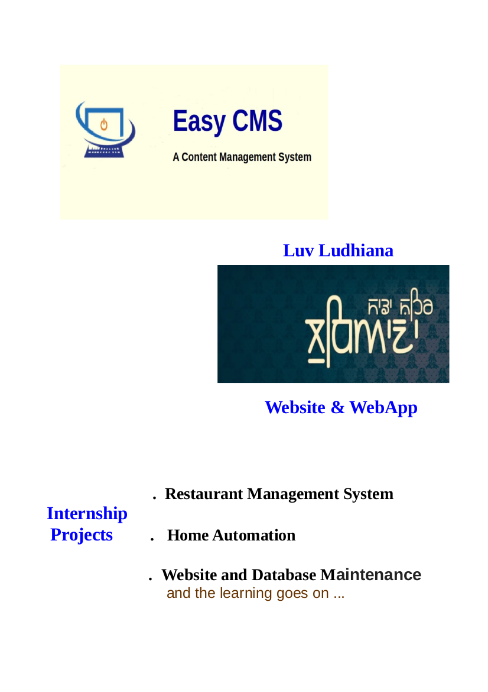

:title: 6-month Training
:data-transition-duration: 1500
:css: tutorial.css

**6-month Training**
===================================

----

:data-x: r-100
:data-y: r+200
:data-rotate-x: 60

*Amarjeet Singh Kapoor*

*1311017*

*135005*

----

:data-x: r+1500
:data-y: r-1000
:data-rotate-x: 0

.. note:: During my 6-month training, I worked on three main projects: OpenSCAD’s customizer, sunehaG and TheRoadproject. Where OpenSCAD being chosen by me as the main project.

----

:data-rotate-x: 90
:data-x: r0
:data-y: r0

Before starting I want to *acknowledge* some people.

* *Dr. H.S. Rai* (Dean TCC and Head of Training)
* *Marius Kintel* (Creator of OpenSCAD)
* *Torsten Paul* ( Developer at OpenSCAD)

----

:data-x: r+1500

.. note::  So, Let’s start with OpenSCAD’s customizer.OpenSCAD is basically the programmers 3D CAD i.e.  we can create 3D models using programming and the programming language used by it for that purpose is SCAD. OpenSCAD is mainly used for 3D printing.

.. image:: images/openscacd.png

----

:data-x: r+2500
:data-y: r0
:data-rotate-y: 180

Flow of OpenSCAD
=================
   
.. note:: SCAD is declarative, a functional programming language which is something like what HTML, CSS, javascript together are for creating the web page but power of all three together in the single language that is specially used for 3D modeling.

.. image:: images/example.png
     
----

:data-y: r-2000

**Here, Is the Demo.**
===================================

----

:data-x: r0
:data-y: r0
:data-rotate-y: 90

.. image:: images/openscad.jpg

.. note:: But It lacked one feature that was the ability to customize the models interactively like in a case of a web page you would have seen an option of zooming and according to which the web page changes or option to change the list view into tables using a widget. So, the similar feature was required in SCAD.
        i.e. a syntax to define widget for variable and using that widget to change the value of the variable in the model.
        So, this requirement defined the base for my project.
        To enhance the syntax of OpenSCAD to make programmer able to define a GUI which would be used to customize the model interactively.

----

:data-x: r0
:data-y: r0
:data-rotate-y: 180

----

:data-x: r+1500
:data-y: r-1000
:data-scale: 0.3

Main Question 
===============

Who needed this and why?

- Modeler

- Client

.. note:: Modeler: They need this feature to calibrate the model as its something which is to be 3D printed so, an even difference of 0.001 units make difference and could break your model and 3D printing is not so cheap at this time.
        Client: They need this feature to customize the model according to their needs but they would not know programming to make changes in the program itself. So, they always want a GUI thing for this purpose. Plus we can’t give the user all the variable to change as they might break the model. So, they need to be restricted access in terms of both which variable they can change and which values they can assign to variables

----

:data-x: r+2500
:data-y: r-2000
:data-scale: 2

**So, We provided them following syntax**
===========================================

----

:data-x: r+2500
:data-y: r-2500
:data-scale: 1

General Syntax to Decorate the Parameter
===========================================

.. code:: c++

	// Description of the Parameter
	variableName= value; //Parameter type and fields

----

*Combo Box*
========================

.. code:: c++

    // Combo box for number
    Numbers=2; // [ 0 , 1 , 2 , 3 ]

    // combo box for string
    Strings= "f o o "; // [ foo , bar , baz ]

    // labeled combo box for numbers
    Labeledvalues =10; // [ 10 : L , 20 :M, 30 : L ]

    //labeled combo box for string
    Labeledvalue="S" ; // [ S : Small , M: Medium , L : Large ]

----

:data-x: r+1900
:data-y: r-2200

*Slider*
========================

.. code:: c++

    // slider widget for number
    slider =34; // [10:100]

    //step slider for number
    stepSlider=2; //[0:5:100]

----

*Check Box*
========================

.. code:: c++

    //description
    Variable = true;

----

*SpinBox*
========================

.. code:: c++

    // spinbox with step size 1
    Spinbox= 5;

    // spinbox with step size 0.001
    Spinbox= 5.233;

    // spinbox with step size 1
    SpinboxWithStep= 5; //3

----

*Text Box*
========================

.. code:: c++

    //Text box for vector with more than 4 elements
    Vector=[12,34,44,43,23,23];

    // Text box for string
    String="hello";

----

:data-x: r+2000

*Vector Widget*
========================

.. code:: c++

    //Text box for vector with less than or equal to 4 elements
    Vector2=[12,34,45,23];

----

:data-x: r0
:data-z: r-10
:data-scale: 0.1

So, This syntax satisfied our basic need but we needed more.
============================================================

----

:data-z: r-1300
:data-scale: 1

Better UX
===========

* Make it easy for a user to group different variables.

* We needed a syntax by which programmers would club different Widgets together.

.. note:: UX is also important. We want to provide the feature to make it easy for a user to group different variables for making it easy for the user to find them and change them. So, we needed a syntax to by which programmers would club different Widgets together and the basis on which they need to be clubbed is depended on a programmer.

----

So, We provided programmers with four type of grouping:
   
* Ungrouped
* Hidden  ``/*[Hidden]*/``
* Global  ``/*[Global]*/``
* User defined  ``/*[ Name of user's choice]*/``

.. note:: ungrouped variable is in the separate group called parameters.
        The Hidden group is used to hide certain parameters which we don't want to appear on customizer.
        The Global group is used to define parameters which are required to come in all the tabs.
        These are user-defined groups.

----

What after the model is customized?
======================================

* We have to manually change the values in the program so that they are saved when we OpenSCAD file next time.
* what If we want to save two different set of parameters for the same program. Copy whole programmer again with new set of parameters

----

This Doesn't Sound like a good Idea.
====================================

----

:data-z: r-1000
:data-rotate-z: 60
:data-scale: 5

**But we have a solution.**

----

:data-z: r-900
:data-y: r-1000
:data-rotate: 0  
:data-scale: 1

* Customize the model and then save that set of parameters in JSON.
* When you open a file again you can:

    * Choose the Required set of values
    * Add new set
    * Update old set
    * Delete sets

It would save a lot of time and efforts.

.. note:: Customize the model and then save that set of value of model in JSON file and when you want to use the same set of values. Just choose that set again and the main catch is that you can save as many sets of values in that file as much you like and then choose which set of values you want. The user is provided with the list of the set of values saved and a user can add the new set, update old set and also delete sets.

----

Structure of JSON in OpenSCAD.

.. code:: json

    {
        "parameterSets":
        {
            "fileFormatVersion": "1"
        "set-name":
        {
            "parameter-name" :"value",
            "parameter-name" :"value"
        },
        "set-name":{
            "parameter-name" :"value",
            "parameter-name" :"value"
        },
        },
        "fileFormatVersion": "1"
    }

----

:data-y: r-1000
:data-x: r+500

Till this point, we have catered two type of users:

* Modelers
* Normal users

*But*

There is one more type of users those **who hate GUI** at all. 

.. note:: 	These could be normal programmers who want to automate things using scripts or even other software which uses OpenSCAD as their back End.

----

Cmd-Line Options 
=================
 

.. note:: So, the Last piece of work was to provide the . OpenSCAD already as a rich number of cmd line option which would help you to do mainly anything that can be done through GUI with a cmd line. So, the same thing needed to be replicated for Customizer.
	You can write values in JSON that you want to customize through the cmd line and then run:

.. code:: shell

  openscad --enable=customizer -o <Output File> -p<Name of Set>
    -P<Name of File> <inputFile>

Example:

.. code:: shell

  openscad --enable=customizer -o new.ast -p examples/Parametric/sign.json 
	-P CongoSign  examples/Parametric/sign.scad
 

----

:data-y: r-2000
:data-z: r-1300

Technologies Used:
=====================

* C++       
* Bison
* Flex
* Qt
* JSON
* Git
* Doxygen
* LaTeX

----

Implementation 
==================================

* **BackEnd**
* **FrontEnd**
* **Interface**

.. note::  BackEnd: This will include the parser part that will create AST nodes and we can extract the parameters from the AST. we can use the single parser for the whole the scad file or separate parser for extracting the parameters with annotations. The Back-end part will also include the parameter extractor and injector or the injector can be included in parameter object which will serve as interface
		Interface: This will include the parameter object which will serve as an interface between both Backend and Frontend. Parameter object will contain information regarding each individual parameter like parameter name, default value, and information how this parameter will be displayed as widgets to the user. Parameter object could also include the method to inject the value of the individual parameter into the AST.h

----

**With this, I end my first project.**
=============================================

* **Download** from (http://www.openscad.org/)
* **Testing** (https://travis-ci.org/openscad/openscad/builds/173779675)
* **Documentations** (https://en.wikibooks.org/wiki/OpenSCAD_User_Manual/WIP#Customizer)

----

:data-y: r0
:data-z: r0
:data-x: r-2000
:data-scale: 0.1

.. image:: images/poster.png

----

:data-scale: 1

.. note:: Next is sunehaG, I will not go into much detail about this. Just want to say that I will be an

**sunehaG will be official messaging app of GNDEC (our college)**

.. image:: images/sunehag.png
	:width: 1000px
	:height: 530px

----

.. image:: images/sunehag1.png
	:width: 1000px
	:height: 630px

----

.. image:: images/sunehag2.png
	:width: 1000px
	:height: 630px

----

:data-rotate: 90

.. note:: It provided features which are basically the combination of the telegram and WhatsApp. Some important features of this app are:

*Features Provided:*
======================
*    Support multiple users on the same device.
*    Allow the single user to login on multiple devices.
*    Encryption.
*    Send files of any type.
*    Use you college id and password to login.
*    Already created groups.
*    Change the message that had been sent.

----

:data-x: r-1000

:data-rotate-x: r90

Work which I did in this app is basically:

* Customizing App to our need

* Configuring and management of the server

* Comparing different clients and server available

* Writing the Script.

.. note:: Work which I did in this app is basically customizing to our need and configuring the server, comparing different clients and server available that could be used by us and then choosing the most suitable one and then converting it from general purpose app to specific purpose app like we only wanted our college students to use this app and they need not create their new account. So, We took the option of signing in and connected it to our college server and much more customizations, configuration, and scripts.

----

:data-rotate-x: 90

This app will be released **officially next semester**

.. note:: This app will be released in next semester officially and might be even with web client also.

----

**The Road Project**
====================

----

:data-y: r-1000
:data-z: r-1000

Objective
============

Automate the analysis of the survey data for construction of road.

.. note:: In simple language, This project intends to provide civil engineers from where could be found from which place soil needs to fill and where they need to extracted to make road plain.

----

In this project, the user will provide the following data files:

*  Data points (x, y) to specify the shape of a road
*  Survey points (x, y, RL)

.. note:: This file will be used to interpolate the required points on road then extrapolate the points perpendicular to that part of a road on both side corresponding to the interpolated point and then save this data in a file for use in the final step.
       
        These are the points collected by the civil engineers that are x, y, RL points where x,y tells the location of point and RL tells the level at that point.

----

This projects will do following work:
======================================

**Step 1:**

* Interpolate the required points on the path of the road
* Then extrapolate the points perpendicular to that part of a road on both side corresponding to the interpolated point
* Then save this data in a file for use in the final step.

.. note::   Data points (x,y) to specify the shape of a road: This file will be used to interpolate the required points on road then extrapolate the points perpendicular to that part of a road on both side corresponding to the interpolated point and then save this data in a file for use in the final step.

----

:data-x: r0
:data-y: r0
:data-z: r-2000

Step 2
========

*    Feed the given data points to GRASS.
*    Then tell GRASS to interpolate RL values for the whole area.
*    Then make contours.

.. note::  Survey points: These are the points collected by the civil engineers that are x, y, RL points where x,y tells the location of point and RL tells the level at that point.

----

Step 3
=======

* We need to extract the required data i.e. RL values

    * Along the path of the road
    * Between the sections that were defined in the first step.
* Then save this data in a file.

.. note:: After above processing is done on data we need to extract the required data i.e. RL values on the path of the road and between the sections that were defined in the first step using the set of extrapolated values. So, we feed the GRASS the data created in the first step and then told it to write the output values in the file and corresponding to this process the 25mb of plain text data was generated which huge amount it's basically more than 40 lakh data points and 1201 files for 12 km road. Then this data was fed to another software which generated the graphs and these were used by civil engineers.

----

:data-rotate: 30

**PROBLEM**
====================

.. note:: But There was the problem that and our systems were incapable of doing this work.

Require the very sophisticated machine to do this task

So, To **overcome this problem** we divided area to be interpolated into small units and then computed them.

----

The main benefit of this Project
====================================

Same work could be done again in future automatically for another project:

* Just in an hr
* Without any human involvement
* which otherwise could have taken more than a week if done manually.

.. note:: The main benefit of doing above work through scripting was that same work could be done again in future for any data. In just an hrs, without any human involvement which otherwise could have taken more than a week if done manually.

----

:data-x: r0
:data-y: r0
:data-z: r0
:data-scale: 0.01  

**Thanks for** bearing with me
==============================

